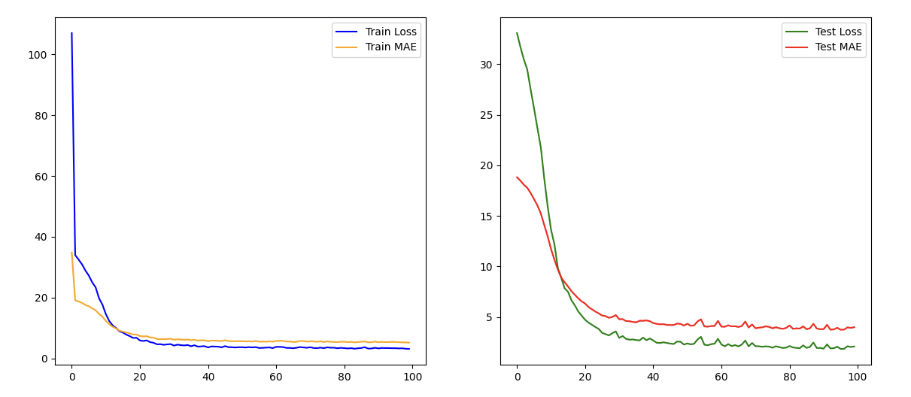

## Epigenetic Clock

Epigenetic clocks are machine learning models that predict age from DNA methylation data. 
This repository trains a simple MLP for this job.

The following datasets were combined to create the data with an 80/20 train/test split:
- [GSE15745](https://www.ncbi.nlm.nih.gov/geo/query/acc.cgi?acc=GSE15745)
- [GSE40279](https://www.ncbi.nlm.nih.gov/geo/query/acc.cgi?acc=GSE40279)
- [GSE41169](https://www.ncbi.nlm.nih.gov/geo/query/acc.cgi?acc=GSE41169)
- [GSE36064](https://www.ncbi.nlm.nih.gov/geo/query/acc.cgi?acc=GSE36064)
- [GSE41037](https://www.ncbi.nlm.nih.gov/geo/query/acc.cgi?acc=GSE41037)
- [GSE41826](https://www.ncbi.nlm.nih.gov/geo/query/acc.cgi?acc=GSE41826)

The CpG sites used as inputs are the same 353 sites used in [Horvath, S. (2013)](https://doi.org/10.1186/gb-2013-14-10-r115).
Additionally, the gender and tissue type of the sample were used as additional inputs.

## TODO
- Increase data size
- Add other biomarkers other than methylation
